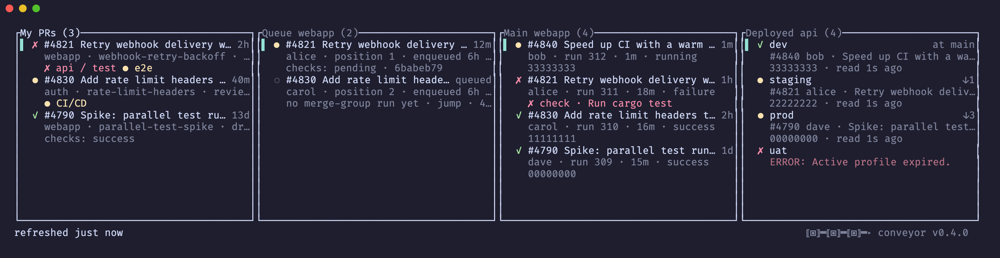
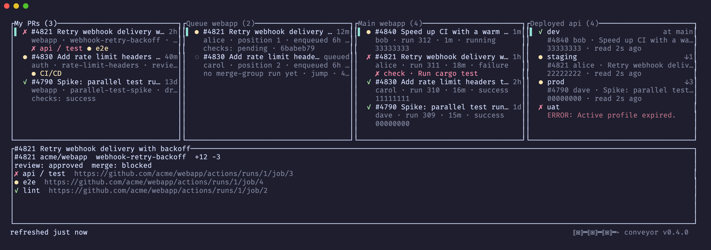
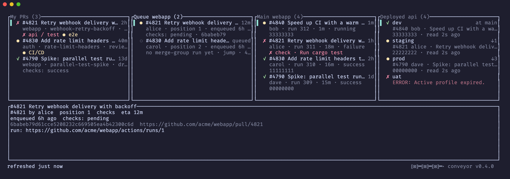
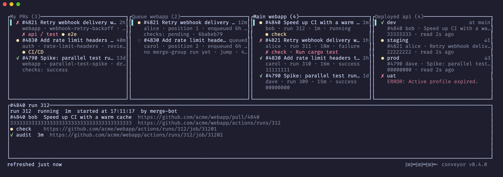
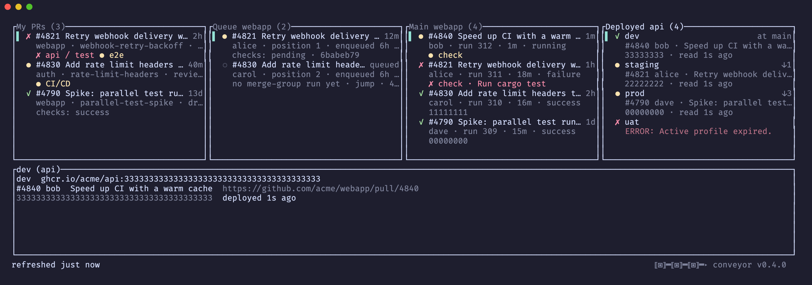
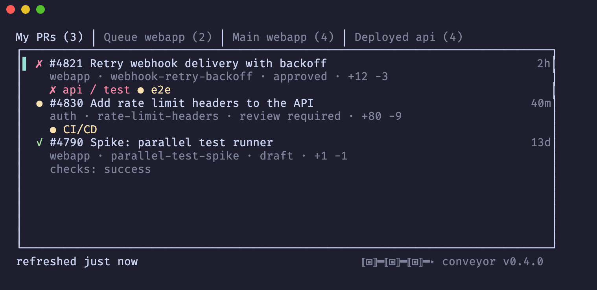

# conveyor

A terminal view of where your changes are: open pull requests, the merge
queue, the last main builds, and what each environment runs. One column per
stage, one repo, one screen.

Status: phase 5. All four columns are live: My PRs, Merge queue, Main builds, Deployed.

Every item is a card of two or three lines: a title line with the status glyph and one
right-aligned figure, then dim lines carrying what you would otherwise open a browser for.
The selected card wears a cyan bar and a bold title.



- **My PRs**: the `[prs] query` search. Card: check glyph, number and title, `⇥n` when the PR
  sits at position n of a merge queue, age; then repo, branch, `draft`, review decision and
  diff size; then the checks that are not green, or the merge state. `b` opens a check run,
  failures first.
- **Merge queue**: the queue of the first `[[repo]]`, or of the repository checked out in the
  current directory. Card: check glyph (from the merge-group run when one exists), number and
  title, ETA or state; then author, position and enqueue age; then the run's checks or
  `no merge-group run yet`, the `solo`/`jump` flags and the head sha. `b` opens the
  merge-group run. A repo without a merge queue shows the error in place.
- **Main builds**: the last `builds` runs of `main_workflow` pushed to `main`. Card: status
  glyph, the PR it merged (from the squash `(#N)` suffix or the commit's pull requests) and
  its title, age; then author, run number, duration and status; then the job that failed and
  the step it failed at, fetched on demand for the selected run and for every failing one.
  `Enter` opens the PR it merged, `b` the run.
- **Deployed**: one row per `[[repo.deploy.env]]`, read with `kubectl` (`--context`,
  `-n`, `get deploy -o jsonpath=…image`, 10 s timeout). The image tag must be the 40-hex
  commit sha (or end with `-<sha>`). Card: the environment and `at main` or `↓n` builds behind
  the Main builds column; then the PR that commit merged; then the sha and how long ago it was
  read, or the error in red. A failed environment (expired session, missing deployment) keeps
  its last known sha with a red `✗`.
  `Enter` opens the PR, `b` the main build that matches the deployed sha.
- Footer: `refreshed just now`, then `refreshed at HH:MM:SS` in local time, for the focused
  column; one braille spinner at the start of the footer while any fetch is in flight; a static
  `conveyor v<version>` logo at the bottom right. Holding `Enter` opens a row once per second, not per repeat.

`p` opens a details pane for the selected card: branch, diff size, review and merge state,
checks with failures first.



On a queue entry it shows position, state, ETA, flags, enqueue age, head sha and the
merge-group run.



On a build it shows the run, status, duration, start time, actor, the merged PR, the sha and
the run's jobs, fetched on demand and listed failures first with the step that failed.



On an environment it shows the image, the merged PR, the sha, when it was last read and any error.



Narrow terminals collapse the columns into tabs:



Keys: `j/k` move, `h/l`/`Tab` focus a column, `Enter`/`o` open in the
browser, `b` open the build behind the row, `y` copy the URL, `p` details pane, `/` filter,
`r` refresh the focused column, `R` refresh all of them, `?` help, `q` quit. Keys act on the focused column.
Below `4 × min_column_width` columns the four columns collapse into tabs (`h/l` switch). A failed fetch keeps
the last rows, marks the column `⚠` and shows the error in the footer; the app never exits on
it.

## Install

Homebrew (macOS, Linux), pulls in `gh` if missing:

```sh
brew install piacsek/tap/conveyor
```

Prebuilt binary (macOS arm64/x86_64, Linux x86_64) into `~/.local/bin`, checked
against the release's SHA-256:

```sh
t="conveyor-$(uname -m | sed s/arm64/aarch64/)-$(uname -s | sed 's/Darwin/apple-darwin/;s/Linux/unknown-linux-gnu/')"
curl -fsSLO "https://github.com/piacsek/conveyor/releases/latest/download/$t.tar.gz{,.sha256}"
shasum -a 256 -c "$t.tar.gz.sha256" && mkdir -p ~/.local/bin && tar xzf "$t.tar.gz" -C ~/.local/bin
```

Releases carry a GitHub build-provenance attestation:
`gh attestation verify "$t.tar.gz" --repo piacsek/conveyor`.

From source (needs Rust 1.98+):

```sh
cargo install --git https://github.com/piacsek/conveyor --locked
```

### Dependencies

Runtime:

- `gh` (GitHub CLI), logged in: `gh auth login`. Every GitHub read goes through it, so its
  keyring login and SSO apply. Homebrew installs it as a dependency.
- `open` and `pbcopy` (macOS) or `xdg-open` and `xclip` (Linux) for opening a row in the
  browser and copying its URL.
- `kubectl` with a working context, only for the Deployed column.

Build: Rust 1.98 or newer. Tests need nothing else; the two opt-in end-to-end tests
(`cargo test -- --ignored`) drive the real binary in a scratch `tmux` server and are the only
place tmux is used. CI runs them on Linux.

## Configure

`~/.config/conveyor/config.toml` (or `$XDG_CONFIG_HOME/conveyor/config.toml`, or the file
named by `CONVEYOR_CONFIG`). Every key is optional; unknown keys are an error.
`conveyor config` prints the effective values:

```toml
[prs]
query = "is:pr is:open author:@me archived:false"
limit = 20
refresh_secs = 60

[ui]
min_column_width = 36
details_percent = 40

[[repo]]                      # optional; default is the repository of the current directory
name = "owner/name"
main_workflow = "CI/CD"       # workflow name or file, e.g. ci.yml
builds = 10                   # runs shown in the Main builds column
refresh_secs = 30

[[repo.deploy]]               # optional; the Deployed column
system = "api"
refresh_secs = 120

[[repo.deploy.env]]
name = "staging"
fetcher = "kubectl"           # the only fetcher so far
context = "my-staging-context"
namespace = "api"
deployment = "api"
```

## Develop

`scripts/gates.sh` runs fmt, clippy, tests and the ignored e2e tests; `scripts/dev-install.sh`
exposes the working tree as `conveyor-dev`; `scripts/ship.sh` gates, installs, commits and
pushes; `scripts/screenshots.sh` re-renders `docs/*.png` from a fixture. See `AGENTS.md`.
